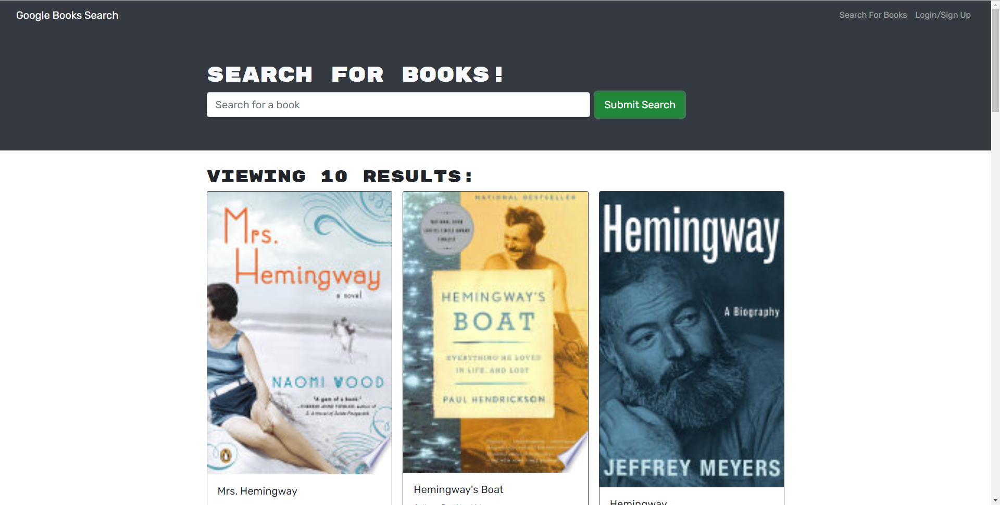

# 21 MERN: Book Search Engine

The Book search engine app was built using the MERN stack with a React front end, MongoDB database, and Node.js/Express.js server and API. It's set up to allow users to save book searches to the back end. 

### 

An Apollo Server was setup to use GraphQL queries and mutations to fetch and modify data, replacing the existing RESTful API.
In this application the authentication middleware is setup to work in the context of a GraphQL API. An Apollo Provider was added so that requests can communicate with an Apollo Server.

### 
The application was deployed to Heroku with a MongoDB database using MongoDB Atlas. 

###
A user can search for new bood to read using a google search engine and save his chosen books in his account.
A user must signup in order to save any book found by search in his account.  After login the user can see his list of saved book.  The user has the option of deleted a book from his saved list by using the delete button.
The homepage shows a login/signup option for the user to login or signup after he clicks on the button. For the signup form the user needs a name, a valid email, and a password as inputs.
After signup using the submit button, the user is logged in and presented with option to logout or save books.
The login form allows a user to login using his email and password.

### Various links showing various application pages

Heroku deployed URL: https://tranquil-ravine-31859.herokuapp.com/

Application GitHub URL : https://github.com/bkoala/Bk_BookSearch_Engine

Home Page Screen Shot : 
Saved Books Screen Shot : 